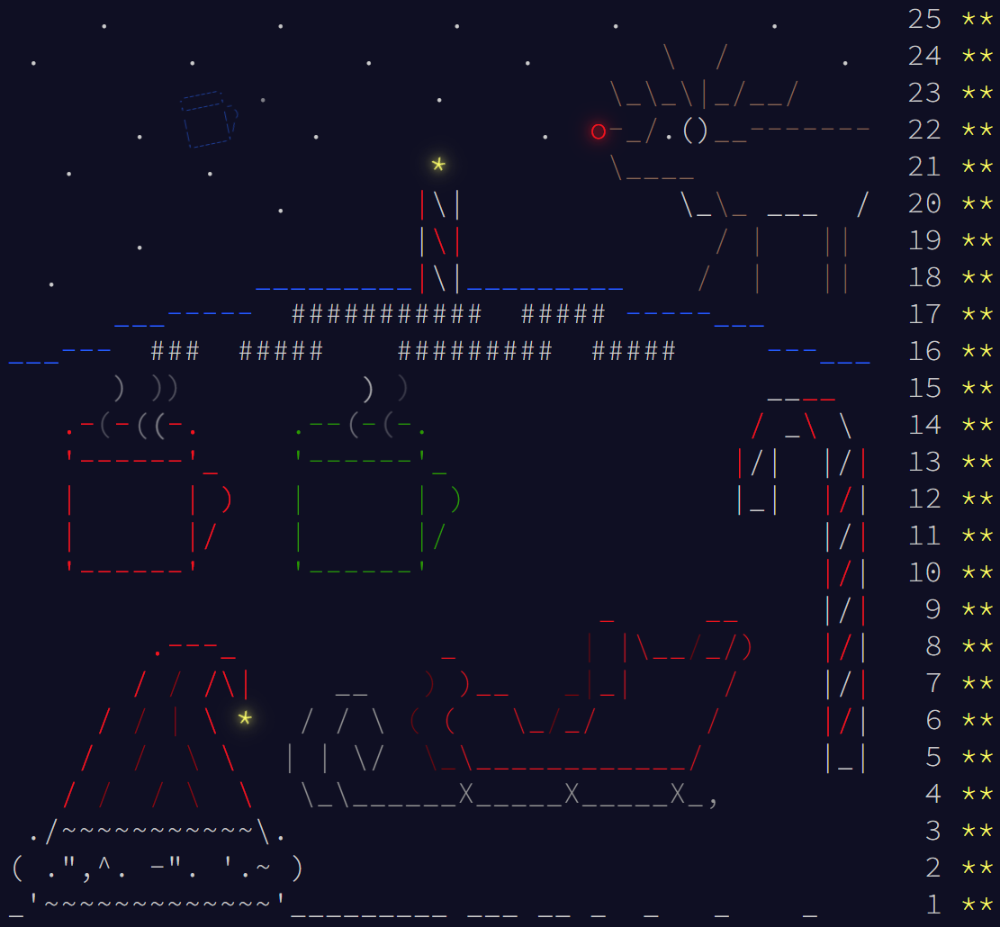

# AdventOfCode2018 :snake:
Solutions to all 25 AoC 2018 problems in modern, type-annotated Python 3.10!

Finishing this year finally gave me the last stars of Advent of Code, I now have all 350 :star: I wanted to finish AoC off in Python to see what it would be like to maybe switch from Rust to Python for AoC 2022. I must say that using Python for AoC is a delight. Things are so simple, while still being really expressive. Unsurprisingly, you skip so much of the boilerplate compared to something like Rust. If I ever want to get a top 100 placing I will probably have to use Python.

I wanted to try the newest version of Python, `3.10`, which finally adds pattern matching to Python. It was nice but I failed to find a usecase in these challenges beyond just strictly comparing values. Using such a recent version of Python was a bit annoying though, I could not get `pip` working and `mypy` does not support the new syntax yet.

## Usage
```sh
# run a solution
python3 src/<DAY>.py

# run all solutions, and run static type checking on each
for DAY in src/*.py; do
  echo -e "\nRunning $DAY"
  python3 $DAY
  mypy $DAY
done
```

Note that at the time of writing `mypy` does not support 3.10 syntax, which means it fails on a lot of the days.

## All years
- [2024](https://github.com/AxlLind/AdventOfCode2024/) in Rust :crab:
- [2023](https://github.com/AxlLind/AdventOfCode2023/) in Rust :crab:
- [2022](https://github.com/AxlLind/AdventOfCode2022/) in Rust :crab:
- [2021](https://github.com/AxlLind/AdventOfCode2021/) in Rust :crab:
- [2020](https://github.com/AxlLind/AdventOfCode2020/) in Rust :crab:
- [2019](https://github.com/AxlLind/AdventOfCode2019/) in Rust :crab:
- [2018](https://github.com/AxlLind/AdventOfCode2018/) in Python :snake:
- [2017](https://github.com/AxlLind/AdventOfCode2017/) in Haskell λ
- [2016](https://github.com/AxlLind/AdventOfCode2016/) in OCaml :camel:
- [2015](https://github.com/AxlLind/AdventOfCode2015/) in Clojure λ


