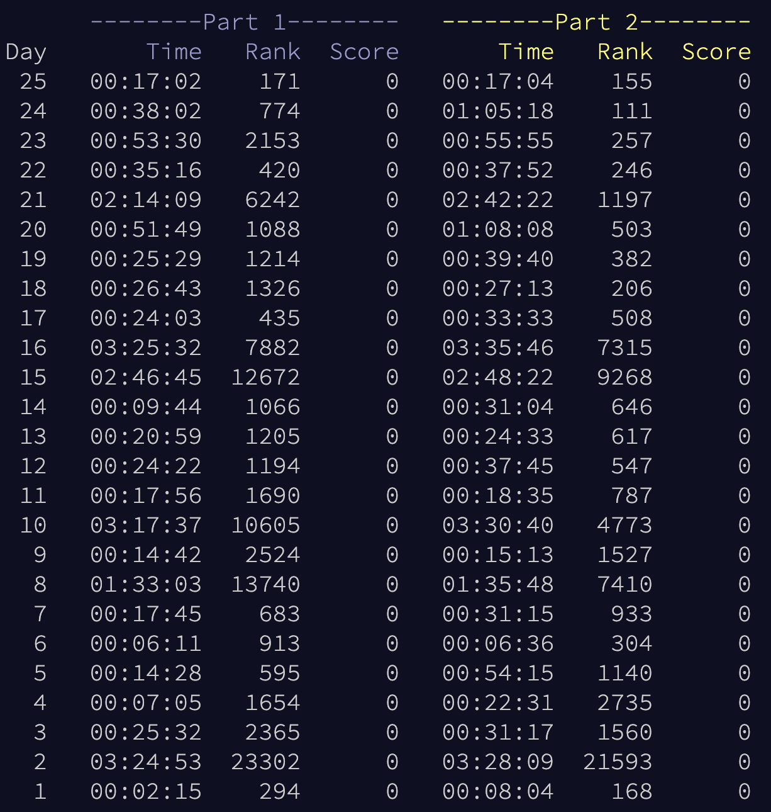

# AdventOfCode2023 :christmas_tree:
Solutions to AoC 2023 in Rust :crab:

## Usage
```sh
# to be able to download inputs (see fetch.sh)
export AOC_SESSION=[value from session cookie]

make       # run todays (if in december 2023)
make $DAY  # run a specific day, e.g 01
make all   # run all days

# directly with cargo, if you prefer
cargo run --release --bin $DAY  # run a specific day, e.g 01
cargo run --release             # run all days
```

## All years
- [2024](https://github.com/AxlLind/AdventOfCode2024/) in Rust :crab:
- [2023](https://github.com/AxlLind/AdventOfCode2023/) in Rust :crab:
- [2022](https://github.com/AxlLind/AdventOfCode2022/) in Rust :crab:
- [2021](https://github.com/AxlLind/AdventOfCode2021/) in Rust :crab:
- [2020](https://github.com/AxlLind/AdventOfCode2020/) in Rust :crab:
- [2019](https://github.com/AxlLind/AdventOfCode2019/) in Rust :crab:
- [2018](https://github.com/AxlLind/AdventOfCode2018/) in Python :snake:
- [2017](https://github.com/AxlLind/AdventOfCode2017/) in Haskell λ
- [2016](https://github.com/AxlLind/AdventOfCode2016/) in OCaml :camel:
- [2015](https://github.com/AxlLind/AdventOfCode2015/) in Clojure λ

## Leaderboard
Getting up at 5:50 every day is tough. Life got in the way a few times. Best placement this year was 111. Went really well this year, especially towards the end.


