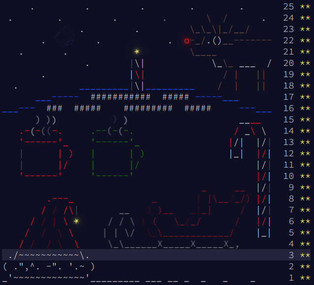

# AdventOfCode2018 :snake:
Solutions to all 25 AoC 2018 problems in modern, type-annotated Python 3.10!
## Usage
```sh
# run a solution
python3 src/<DAY>.py

# run all solutions, and run static type checking on each
for DAY in src/*.py; do
  echo -e "\nRunning $DAY"
  python3 $DAY
  mypy $DAY
done
```

Note that as of writing this, `mypy` does not support 3.10 syntax, meaning it fails on a lot of the days.

## Other years
- [2021](https://github.com/AxlLind/AdventOfCode2021/) in Rust 🦀
- [2020](https://github.com/AxlLind/AdventOfCode2020/) in Rust :crab:
- [2019](https://github.com/AxlLind/AdventOfCode2019/) in Rust :crab:
- [2017](https://github.com/AxlLind/AdventOfCode2017/) in Haskell λ
- [2016](https://github.com/AxlLind/AdventOfCode2016/) in OCaml :camel:
- [2015](https://github.com/AxlLind/AdventOfCode2015/) in Clojure λ


