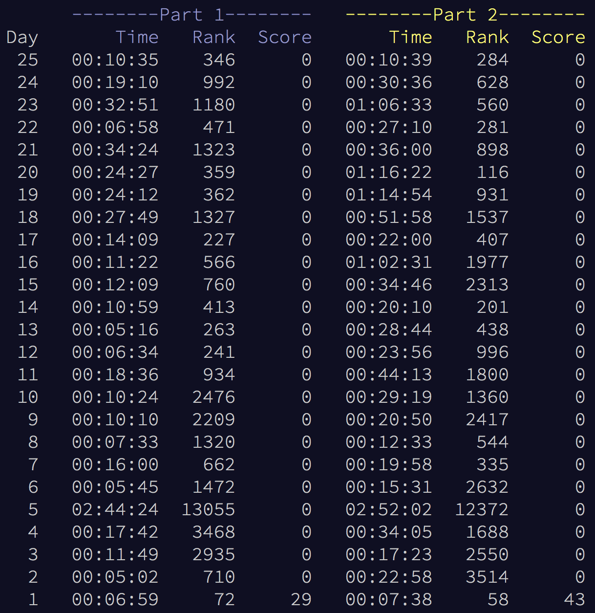

# Advent of Code 2019
My solutions to all [Advent of Code 2019](https://adventofcode.com/2019) problems. I did them in Rust to get more familiar with the language. This was the first year I participated. The parts with the [IntCoder](./src/intcoder.rs), simulating a custom CPU-architecture, were so cool and opened up many interesting puzzle-possibilities. I learned a ton and got a lot better at Rust!

Huge thanks to everyone who makes AoC possible!

## Usage
To run any of the solutions use the command `cargo run --release --bin DAY_NUMBER`. All solutions finish in under `100ms` on my machine and the total running time of all 50 stars is under `500ms`!

You can see the output and wall-clock timing for each solution [here](./Output.md).

## Other years
- [2022](https://github.com/AxlLind/AdventOfCode2022/) in Rust :crab:
- [2021](https://github.com/AxlLind/AdventOfCode2021/) in Rust :crab:
- [2020](https://github.com/AxlLind/AdventOfCode2020/) in Rust :crab:
- [2018](https://github.com/AxlLind/AdventOfCode2018/) in Python :snake:
- [2017](https://github.com/AxlLind/AdventOfCode2017/) in Haskell λ
- [2016](https://github.com/AxlLind/AdventOfCode2016/) in OCaml :crab:
- [2015](https://github.com/AxlLind/AdventOfCode2015/) in Clojure λ

## Leaderboard
I did not attempt to get high leaderboard scores since, in my timezone, I would have to get up very early. I still managed to get around top 1-2k on a lot of the later ones and even `774th` on [one star](./src/bin/22.rs). Finished most of them the day they came out.

