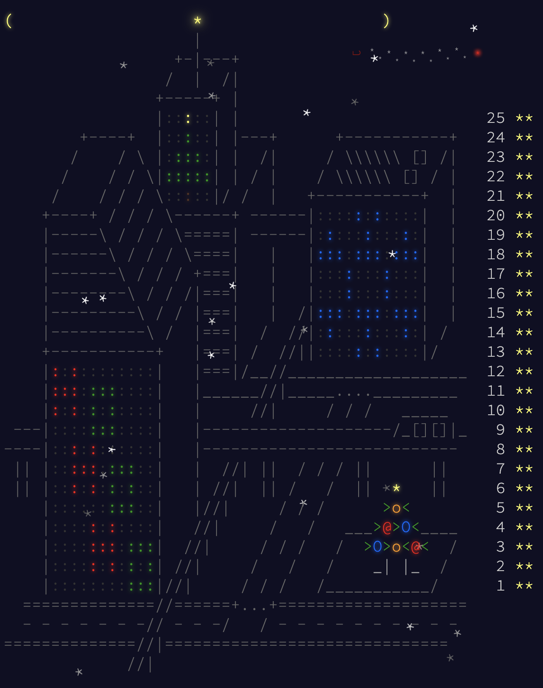

# AdventOfCode2017 λ
Solutions to all 25 AoC 2017 problems in Haskell!

Aside from some small things at university, this was pretty much my first time writing Haskell. Having just done an AoC year in [OCaml](https://github.com/AxlLind/AdventOfCode2016/), I felt like the time was right to give Haskell a shot. I surprised at how much I liked it actually. The focus of writing really terse code makes it easier to write and often understand. The things that really bothered me with OCaml was not really present in Haskell. The standard library for example is really nice, meaning you really can write short and understandable functional code. In OCaml you spent most of your time implementing helper functions you in Haskell find in the stdlib.

My only gripe with Haskell is the very unreliable performance. Some functions that I would expect to compile down to a while loop take literally seconds to execute, while a Rust equivalent finishes in less than a millisecond. Sometimes adding a [bang pattern](https://downloads.haskell.org/~ghc/7.8.3/docs/html/users_guide/bang-patterns.html) would increase performance by 100x, why can't the compiler realize that? Sometimes transforming a naive recursive function with a counter into an `iterate fn !! count` would make it 10x slower. All of this was compiled with `-O`, so that was a bit disappointing. You probably learn to recognize performance pitfalls but to a newbie it was very unintuitive what will be fast and what will be slow in Haskell.

## Usage
```sh
./run.sh DAY
```

## Other years
- [2020](https://github.com/AxlLind/AdventOfCode2020/) in Rust :crab:
- [2019](https://github.com/AxlLind/AdventOfCode2019/) in Rust :crab:
- [2016](https://github.com/AxlLind/AdventOfCode2016/) in OCaml :camel:
- [2015](https://github.com/AxlLind/AdventOfCode2015/) in Clojure λ


