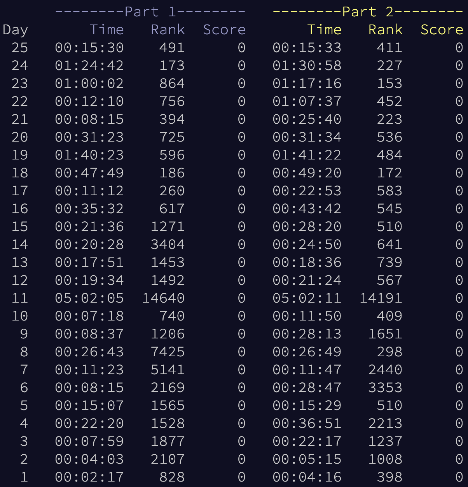

# AdventOfCode2022 :christmas_tree:
Solutions to all 25 AoC 2022 in Rust :crab: Using less than 100 lines per day, and with a total runtime of `0.82` seconds.

I really liked 2022, it was a good AoC year. It was the year I finally reached my goal of hitting the top 100, 25th place on [day 19](./src/bin/19.rs)!

For execution time of each solution, see [timings.md](./timings.md).

## Usage
```sh
cargo run --release --bin DAY # run a specific day
cargo run --release           # run all days
```

## Other years
- [2023](https://github.com/AxlLind/AdventOfCode2023/) in Rust :crab:
- [2021](https://github.com/AxlLind/AdventOfCode2021/) in Rust :crab:
- [2020](https://github.com/AxlLind/AdventOfCode2020/) in Rust :crab:
- [2019](https://github.com/AxlLind/AdventOfCode2019/) in Rust :crab:
- [2018](https://github.com/AxlLind/AdventOfCode2018/) in Python :snake:
- [2017](https://github.com/AxlLind/AdventOfCode2017/) in Haskell λ
- [2016](https://github.com/AxlLind/AdventOfCode2016/) in OCaml :camel:
- [2015](https://github.com/AxlLind/AdventOfCode2015/) in Clojure λ

## Leaderboard
This year I finally reached my goal of ending up on the leaderboard. On [day 19, part 1](./src/bin/19.rs) I got 25th in the world.


